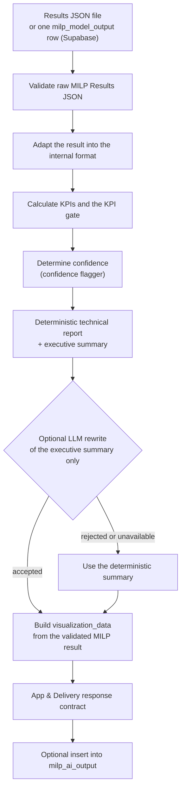
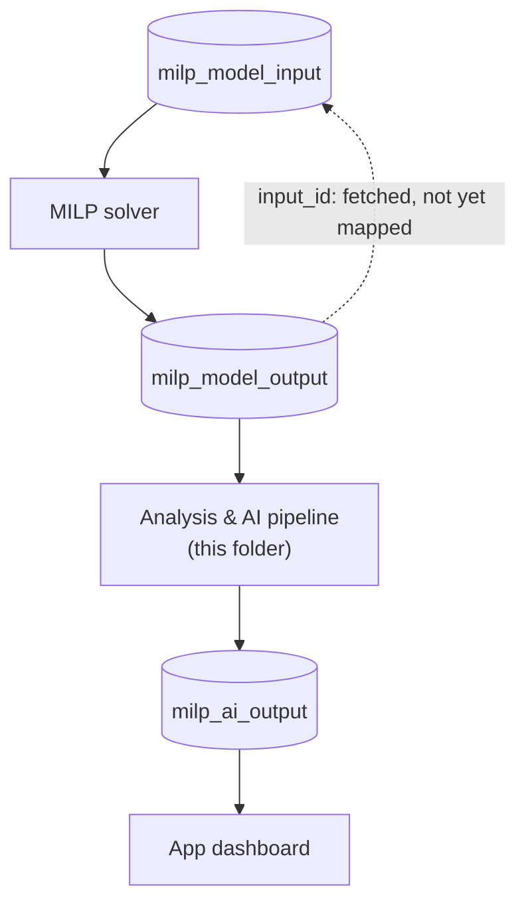
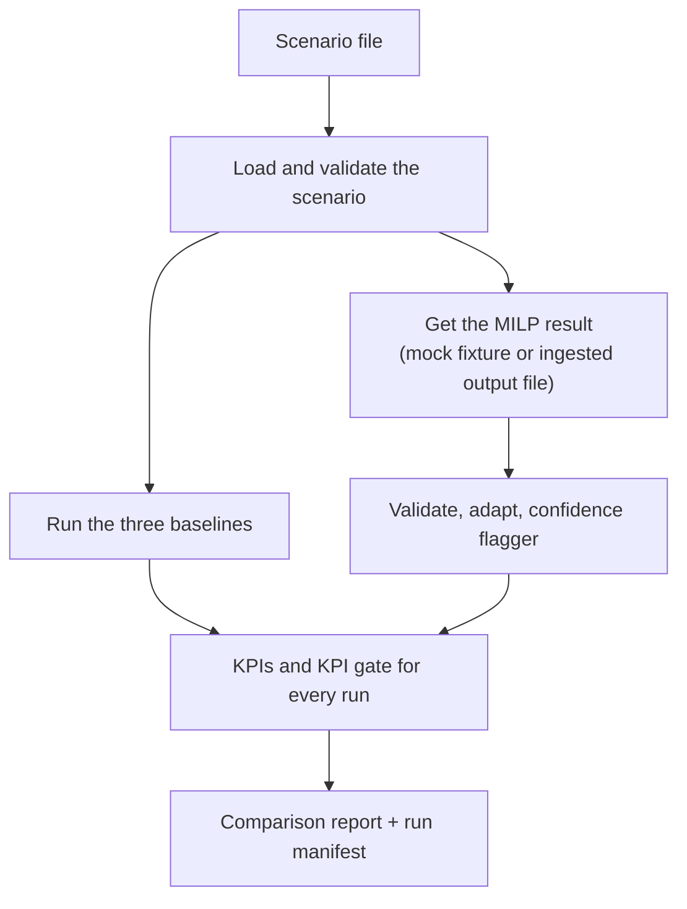

# AI Pipeline Architecture and Component Status

This file shows how the Analysis & AI components fit together and the current
status of each one. It is a living tracker: update the status table whenever a
component's PR is opened, merged or blocked.

The pipeline-flow and database-flow diagrams below are based on `AI/README.md`
(added in PR #58). `AI/README.md` stays as the setup and command guide.

The diagrams use Mermaid, so GitHub draws them as pictures. To edit one,
change the text inside its `mermaid` block.

## Pipeline flow

Based on the "Pipeline order" steps in `AI/README.md`. This is what
`AI/main.py` runs for one MILP result.

The report, summary and LLM steps are covered in detail in
`AI/explanations/LLM_Explanation_Layer_Overview.md` (Task 93), so they are not
repeated here.

## Database input/output flow

The dotted line is the link that is fetched but not used yet. See the
"Known integration blocker" section in `AI/README.md` for why.

## Components not shown in the diagrams above

The diagrams above cover `AI/main.py`. Three components sit partly or fully
outside that flow.

### Confidence flagger (`AI/results/confidence_flagger.py`)

- **Used by:** `AI/main.py` (the "Determine confidence" step) and
  `AI/evaluation/batch_runner.py`.
- **What it does:** labels a result `MEASURED`, `PROVISIONAL` or `UNKNOWN`
  based on whether the source data behind it was measured or estimated.
  Since Task 57 it matches the MILP source decisions to the scenario's source
  records by `source_id`, because the MILP output no longer carries provenance.

### Baselines (`AI/baselines/`)

- **Used by:** `AI/evaluation/batch_runner.py` only, through
  `baseline_runner.run_all_baselines`. Not part of `AI/main.py`.
- **What they do:** run three simple rules (equal blend, cheapest first,
  fixed priority) on the same scenario, so the MILP result has something to
  be compared against.

### Sensitivity ranking (`AI/results/sensitivity_ranking.py`)

- **Used by:** not called by `AI/main.py` or `AI/evaluation/batch_runner.py`
  yet. It is currently only run by its own tests.
- **What it does:** `rank_sensitivities` checks whether sensitivity entries
  refer to estimated source data, and only ranks them when the data supports
  a fair comparison.

### Evaluation flow (`AI/evaluation/batch_runner.py`)

This shows the batch runner once PR #57 (Task 59) merges.

## Component status

**Last checked:** 29 September 2026

| Component | Task | PR | Status | Open blocker |
|---|---|---|---|---|
| Pipeline entry point (`main.py`) | 61 | #48 | Merged | Still calls the confidence flagger with the old `data_flags.sources` input, not the Task 57 source match. |
| `main.py` output contract | 86 | #62 | Merged into task-61 | Merged after #48 reached master, so it is not on master yet. |
| KPI calculator and gate | 87 | #65 | Merged | Optimiser feasibility and cost show "not reported" on v1.0 results until the KPIs read the v1.0 fields. |
| App response adapter | 88 | #59 | Merged | None. |
| Batch runner | 89 | #68 | Merged | Passes an empty list to the confidence flagger, so batch runs always show `UNKNOWN`. #57 replaces this. |
| Batch and evaluation harness | 59 | #57 | In review | Re-review requested 29 Sep. |
| Confidence flagger | 57 | #54 | Merged | Real provenance lives in Supabase, so runs from scenario files show `UNKNOWN`. `main.py` does not use the new input yet (see its row). |
| Sensitivity ranking | 90 | #66 | Merged | Not called by `main.py` or `batch_runner.py`. |
| JSON explainer | 91 | #64 | Merged | None. |
| Baselines and scenario validator | 92 | #61 | Merged | None. |
| LLM and explanation layer docs | 93 | #60 | Merged | None. |
| Component status overview (this file) | 94 | - | In review | None. |

## How to keep this file updated

- Update a row when its PR is opened, merged, closed or blocked.
- Change the **Last checked** date whenever you review the table.
- "Merged" means merged into `master`. If a PR was merged into another
  branch, say which one.
- Write blockers as short facts, and remove them once they are resolved.
